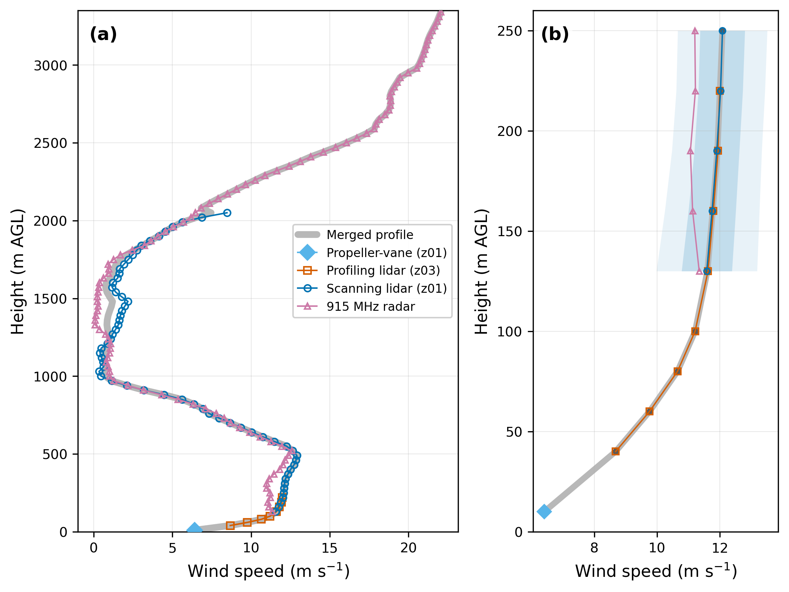

# WINDPROF

Merged wind and turbulence profiles from multiple instruments, built for four coastal sites of the Third Wind Forecast Improvement Project (WFIP3): Nantucket, Block Island, Cape Cod, and Rhode Island.

WINDPROF ingests scanning and profiling Doppler lidar, radar wind profiler, sonic anemometer, and surface meteorological data; applies instrument-specific quality control; retrieves winds from lidar radial velocities with velocity-azimuth display (VAD) fits; and merges the results into one height-resolved wind and turbulence profile every 10 minutes on a common vertical grid.



*One merged profile at Block Island during a low-level jet, 13 February 2024, 08:10 UTC. Each instrument is shown at the heights where it reported, with the merged profile in gray; panel (b) enlarges the lowest 250 m. Below 1000 m the radar is shown for comparison and does not enter the merged value where a lidar reports. Shading in (b) is the scanning lidar's scan-to-scan wind speed variability over the window, not measurement uncertainty. Figure from the paper cited below.*

> **Looking for the data?** The processed WFIP3 profiles are archived on the [DOE Wind Data Hub](https://wdh.energy.gov/ds/wfip3/): Nantucket [doi:10.21947/3014081](https://doi.org/10.21947/3014081), Block Island [doi:10.21947/3014087](https://doi.org/10.21947/3014087), Cape Cod [doi:10.21947/3014349](https://doi.org/10.21947/3014349), Rhode Island [doi:10.21947/3014814](https://doi.org/10.21947/3014814). You do not need this repository to use them. The code is for understanding the processing or adapting it to another multi-instrument campaign.

## Example


*One merged profile at Block Island during a low-level jet, 13 February 2024, 08:10 UTC. Each instrument is shown at the heights where it reported, with the merged profile in gray; panel (b) enlarges the lowest 250 m. Below 1000 m the radar is shown for comparison and does not enter the merged value where a lidar reports. Shading in (b) is the scanning lidar's scan-to-scan wind speed variability over the window, not measurement uncertainty. Figure from the paper cited below.*

## Scientific reference

Lipari, S., et al. (2026). *A Multi-Instrument Framework for Boundary Layer Wind and Turbulence Profiling.* Atmospheric Measurement Techniques (in preparation).

Methods are cited inline in the code where they are used.

## Sites and instruments

Instrument labels (z01, z02, z03) follow the WFIP3 datastream names and do not mark a fixed role across sites: the profiling lidar is z03 at Nantucket, Block Island, and Rhode Island but z01 at Cape Cod.

| Site | Scanning lidar | Profiling lidar | Radar wind profiler | Near-surface wind |
|------|----------------|-----------------|---------------------|-------------------|
| Nantucket (NANT)    | Halo XR+ (z01), Halo XR (z02) | Leosphere WindCube V2.1 (z03) | NOAA PSL 915 MHz | METEK uSonic-3 Class A sonic anemometer (z02, 5 m) |
| Block Island (BLOC) | Halo XR (z01)     | Leosphere WindCube V1 (z03) | NOAA PSL 915 MHz | R.M. Young propeller-vane on the surface meteorological station (10 m; speed and direction only) |
| Cape Cod (CACO)     | Halo XR+ (z02)    | Leosphere WindCube V2 (z01) | not used | Gill R3-50 sonic anemometers (z01 4 m, z02 10 m) |
| Rhode Island (RHOD) | Halo Galion (z01) | ZephIR-300 (z03)            | not used | Gill R3-50 sonic anemometer (z01, 4 m) |

Each site's surface meteorological station supplies pressure, temperature, humidity, and precipitation; the Rhode Island station does not measure precipitation.

## Installation

```bash
conda env create -f environment.yml
conda activate windprof
pip install -e .
```

Or, in any Python 3.9+ environment, `pip install -e ".[test]"`.

## Configuration

WINDPROF reads inputs from two roots and writes output to a third:

```bash
export WINDPROF_DATA_PATH=/path/to/wfip3/raw          # locally curated inputs: scanning lidars, radar
export WINDPROF_ARCHIVE_PATH=/path/to/wfip3/archive   # campaign archive tree as delivered: profiling lidars, sonics, surface met
export WINDPROF_RESULTS_PATH=/path/to/wfip3/output    # merged NetCDF output
```

If unset, they default to `./data`, `/data`, and `./results`.

Everything site-specific lives in [`windprof/config.py`](windprof/config.py):

- `LOCATION_CONFIG`: instrument coordinates and elevations, azimuth corrections to true north (`wind_corrections`), vertical-velocity sign conventions (`w_sign_corrections`), and anemometer heights and corrections
- `QC_CONFIG`: the signal-quality screen for each instrument (which signal is tested, such as intensity or carrier-to-noise ratio, and its threshold)
- `MIN_VAD_BEAMS`, `MALFUNCTION_PERIODS`, `SITE_CODES`, and `SITE_INSTRUMENT_MAPPINGS` (the datastream read for each instrument)

## Usage

Process a range of dates for one site in parallel:

```bash
python -m windprof.process_parallel nantucket --start-date 2024-03-01 --end-date 2024-03-07 --n-processes 4
```

Before processing, every configured datastream is looked up across the date range, and the run refuses to start if one resolves no files, because a missing instrument would otherwise be left out without an error. Pass `--allow-missing-inputs` to proceed anyway. Dates whose daily file already exists are skipped unless `--no-skip` is given.

Process a single date from Python:

```python
from windprof.config import DATA_BASE_PATH
from windprof.pipeline import process_wind_profiles_for_date

process_wind_profiles_for_date("2024-03-01", base_dir=f"{DATA_BASE_PATH}202403", location="nantucket")
```

## Module layout

| File | Role |
| --- | --- |
| `config.py` | Site layouts, coordinates, elevations, corrections, quality-control thresholds, datastream names, paths |
| `wind_analysis.py` | VAD fitting, hybrid wind speed (Rosenbusch et al. 2021), error propagation |
| `quality_control.py` | Per-instrument signal screening, availability, inter-instrument agreement flags |
| `lidar_parsers.py` | Readers that turn profiling-lidar files and Cape Cod workbooks into arrays |
| `lidars.py` | Scanning (VAD) and profiling lidar processing into 10-minute profiles |
| `radars.py` | Radar wind profiler consensus ingestion (NOAA PSL WINDS text and NetCDF) |
| `anemometers.py` | Sonic anemometer readers |
| `merging.py` | Hierarchical merging across instruments, quality flags, surface meteorology |
| `discovery_and_export.py` | File discovery, the input pre-flight check, CF-1.10 and ACDD-1.3 NetCDF export |
| `pipeline.py` | Per-date orchestration |
| `process_parallel.py` | Parallel processing across dates |
| `plotting.py` | Diagnostic profile plots and daily Hovmöller summaries |

## Output

One NetCDF file per site and day, `{site}.windprof.z01.c1.{YYYYMMDD}.000000.nc`, following CF-1.10 and ACDD-1.3. Time steps are 10 minutes, each labeled by the start of its window; heights are above ground level. Merged fields end in `_merged` and per-instrument fields end in the instrument key (for example `wind_speed_lidar_z01`). Surface meteorology is in the `surface_*` variables, and `instrument_availability` is a bitmask of the instruments contributing at each time step.

Merged fields carry quality flags (`qc_*_merged`) with values 0 = good, 1 = suspect, 2 = bad, 3 = no value (no measurement, or rejected by instrument quality control). Missing values are −9999.

## Data quality and corrections

All wind directions are reported in the true-north meteorological convention. Site- and instrument-specific azimuth and vertical-velocity sign corrections are set in `config.py`, and their derivation is described in the manuscript. Known limitations of the archived product are listed in the data quality note distributed with each dataset on the [DOE Wind Data Hub](https://wdh.energy.gov/ds/wfip3/).

## Adapting WINDPROF to another campaign

Adapting the pipeline concentrates the work in a few files. In rough order of effort:

1. **Add the site to `config.py`.** Copy an existing `LOCATION_CONFIG` block and set coordinates, elevations, `wind_corrections`, `w_sign_corrections`, and, for anemometers, `anemometer_heights` and `anemometer_corrections`. Then add the site to `SITE_CODES` and `SITE_INSTRUMENT_MAPPINGS`. Check how `anemometer_corrections` is applied by the reader you use: the Nantucket and Block Island readers rotate the wind components, while the Cape Cod and Rhode Island readers add the value to the wind direction.
2. **Set the quality-control screen.** Add each instrument to `QC_CONFIG` and review `MIN_VAD_BEAMS`. Scan-segmentation settings for scanning lidars are in `lidars.py`.
3. **Add readers for new file formats.** `detect_profiling_lidar_file_type` in `lidar_parsers.py` dispatches on the profiling-lidar file type, and `parse_caco_lidar_file` reads the Cape Cod workbooks. Every reader needs a matching processing function in `lidars.py`.
4. **Extend file discovery.** Per-site path templates are in `discovery_and_export.py`.

## Tests

```bash
pytest
```

The suite covers VAD beam selection, height datum handling, the near-surface grid, instrument readers, merging and quality flags, surface meteorology, and CF/ACDD export. Tests that need real campaign files skip when those files are absent; [`tests/data/README.md`](tests/data/README.md) lists the files and where to put them.

## License

BSD 3-Clause. See [LICENSE](LICENSE).
